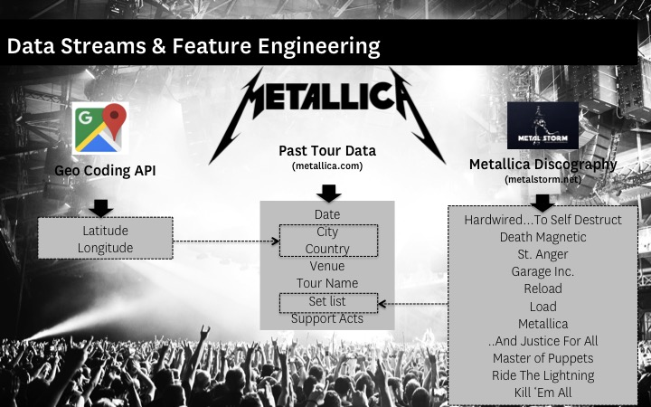

# Project Goals

To curate a detailed data set containing all of Metallica’s live performances to date. Data to be enhanced by two other data streams in order to further enrich it and make it more useful/interesting for analytical purposes further down the line. 

Next stage is to do some initial analysis and create some interactive dashboards for people to do their own analysis.

# Why I created the project 

Despite being one of the most successful heavy metal bands of all time (link), any readily available data for Metallica is limited. 

There are a handful of [existing](https://www.kaggle.com/conklindata/metallica-song-catalog/version/1) (and unofficial) CSV files, although these focus on album and track data and not live performances.

The most thorough (and accurate) data available for live performances can be found on metallica.com, however it is only currently available in html form and they haven’t made it available for fans to download in a more manipulative state – which is where this project comes in.

So the benefits to this project are three fold:

  - I get to create a useful and possibly unique dataset that doesn’t exist online anywhere
  - I get to add value to the Metallica community!
  - I get to practice some key data science skills: 
    - Acquiring data from ‘hard-to-find’ locations (i.e web scraping)
  - I get to work with multiple data sets and engineer new features. These include integrating live performance data with:
    - Album data
    - Geocoded data

# Methodology & Approach

The best approach will involve some kind of web scraping. I will use Selenium for the web scraping stage and Pandas to manage data manipulation and analysis. In addition to scraping from Metallica.com I also would like to integrate further streams of data unavailable on Metallica.com - specifically latitude and longitude data for each gig (we can make some interesting map visuals with this) and additional album level data (which we can use to work out live plays by album).

The diagram below summarises the data streams I intend to obtain and how I intend them to work with one another.

Once I’ve scraped, cleaned and integrated all these data streams into a final .csv file, I can then begin to look at analyzing and visualizing the data.

The project in its current state splits into three stages and for ease of reading I’ve split this across three notebooks

[1.1_Data_Acquisition_Primary_Data](https://github.com/kitsamho/Metallica-Gig-Analysis/blob/master/1.1_Data_Acquisition_Primary_Data/1.1_Data_Acquisition_Primary_Data.ipynb)

[1.2_Data_Acquisition_Supporting_Data](https://github.com/kitsamho/Metallica-Gig-Analysis/tree/master/1.2_Data_Acquisition_Supporting_Data)

[2_Data Cleaning_Feature Generation](https://github.com/kitsamho/Metallica-Gig-Analysis/tree/master/2_Data%20Cleaning%20%26%20Feature%20Generation)

I intend to continuously build on this project as time goes on so will add new notebooks as and when I have time to add to the project.

# How to install & run the project

Feel free to fork and clone this project! You’ll need a github account and a python environment to run the code, Jupyter notebook might make sense seeing as that’s what I wrote in.

## Some key libraries are required in order to run this:

Selenium
Chromedriver / Webdriver
TQDM Notebook (not essential, but helps to see progress)
Pandas
Numpy
Googlemaps( note - if you want to use Google’s API then you will need to add your API key in the script where I’ve made a note)

## Final Data

If you want the final, clean data you can get it [here](https://github.com/kitsamho/Metallica-Gig-Analysis/tree/master/0_Final%20Clean%20Data)

## Observations & Improvements

There are a couple of key updates I'd like to make:

Metallica are almost always touring so there is a need to update this database regularly. So in future updates, I'd like to adapt my python script to check Metallica.com for any new gigs and if there any, automatically add them to the database in a cleaned state with minimal coding required from a user. 

If I can host all this on a webapp as well, even cooler :)

